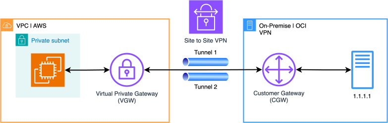

## Introduction

We will create this infrastructure


## Terraform | AWS

1. Create a Customer Gateway

```terraform
resource "aws_customer_gateway" "on_premise" {
  bgp_asn    = 31898 # For OCI
  ip_address = "1.1.1.1" # VPN IP Address
  type       = "ipsec.1"

  tags = {
    Name = "on_premise_cgw"
  }
}
```

2. Create Virtual Private Gateway

```terraform
data "aws_vpc" "main" {
  filter {
    name   = "tag:Name"
    values = ["my vpc"]
  }
}

resource "aws_vpn_gateway" "main" {
  vpc_id = data.aws_vpc.main.id

  tags = {
    Name = "main_vgw"
  }
}
```

3. Create Site to Site Connection

```terraform
resource "aws_vpn_connection" "oci" {
  vpn_gateway_id           = aws_vpn_gateway.main.id
  customer_gateway_id      = aws_customer_gateway.on_premise.id
  type                     = "ipsec.1"
  static_routes_only       = false  # Requires BGP
  tunnel_inside_ip_version = "ipv4" # Requires

  local_ipv4_network_cidr  = "0.0.0.0/0"
  remote_ipv4_network_cidr = "0.0.0.0/0"

  tunnel1_inside_cidr = "169.254.80.0/30" # Selected CIDR /30 following OCI restrictions
  tunnel2_inside_cidr = "169.254.90.0/30" # Selected CIDR /30 following OCI restrictions

  tunnel1_ike_versions = ["ikev2"]
  tunnel2_ike_versions = ["ikev2"]

  # Must not be hardcoded
  tunnel1_preshared_key = "BG8NRYUhyxwuKMtwUM4LA5e2X8YyhfgoTFnCD0UL"
  tunnel2_preshared_key = "AG8NRYUhyxwuKMtwUM4LA5e2X8YyhfgoTFnCD0UL"

  tags = {
    Name = "s2s_connection"
  }
}
```


## Resources
- [OCI configuration Process](https://docs.oracle.com/en-us/iaas/Content/Network/Tasks/vpn_to_aws.htm)
- [A brief explanations of site to site VPN | AWS.](https://www.youtube.com/watch?v=P1rs9dWY6Hc)
- [How to mount a VPN in AWS in 7 min | Spanish](https://www.youtube.com/watch?v=jDuewDSyl9I)
- [Setup an AWS Site-to-Site Virtual Private Network (VPN) in 18 min](https://www.youtube.com/watch?v=7tTrN8WXMlg)
